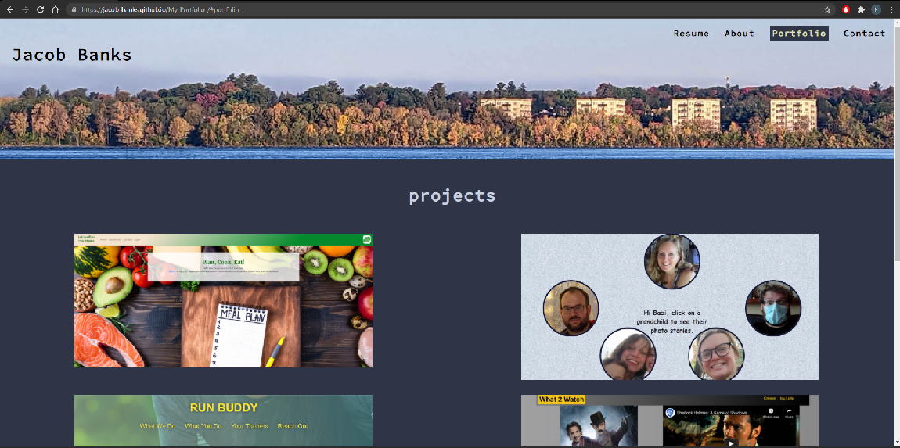

# my portfolio

## Description

A react built Portfolio. Read all about me, Check Out my Projects, Get in touch! Take a look at my resume!

## Table of Contents

- [Installation](#installation)
- [Usage](#usage)
- [Credits](#credits)
- [License](#license)
- [contributing](#contributing)
- [questions](#questions)

## Installation

Clone/Fork repo, install packages(npm install),start the server (npm start)

## Usage

Please visit this site. https://jacob-banks.github.io/My-Portfolio-/

## Credits

Jacob Banks

## License

This project is [MIT](https://choosealicense.com/licenses/MIT/) licensed. 
Copyright © 2021 [jacob-banks](https://github.com/jacob-banks)
